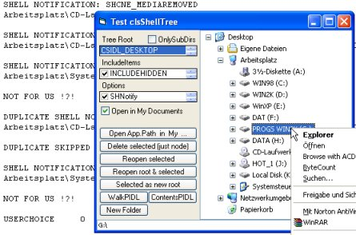



## Pidl'ed COM\-grunting shell\-aware tree \(aka Explorer alike Treeview\)

### Description

A folder browser extension for the ucTreeView (Id=59769). Using pidls, COM interfaces (IShellFolder,IContextMenu3,IDataObject,IDropTarget,IDragSourceHelper ..), Shell Change Notifications. You won't get all of explorer's tree capabilities, but all the source.

Caveat: Functional but experimental project.Read ReadMe.
 
### More Info
 

             |
---                |---
**Submitted On**   |2005-06-27 15:23:48
**By**             |[OrlandoCurioso](https://github.com/Planet-Source-Code/PSCIndex/blob/master/ByAuthor/orlandocurioso.md)
**Level**          |Advanced
**User Rating**    |4.8 (58 globes from 12 users)
**Compatibility**  |VB 6\.0
**Category**       |[Custom Controls/ Forms/  Menus](https://github.com/Planet-Source-Code/PSCIndex/blob/master/ByCategory/custom-controls-forms-menus__1-4.md)
**World**          |[Visual Basic](https://github.com/Planet-Source-Code/PSCIndex/blob/master/ByWorld/visual-basic.md)
**Archive File**   |[Pidl'ed\_CO1906066272005\.zip](https://github.com/Planet-Source-Code/orlandocurioso-pidl-ed-com-grunting-shell-aware-tree-aka-explorer-alike-treeview__1-61324/archive/master.zip)

